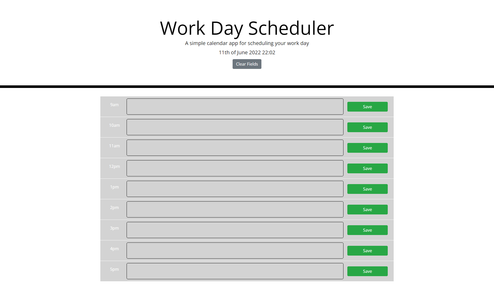

# Day Scheduler

A simple app where the user can view their daily tasks (after type one of them) & delete individual old tasks or by clicking button at the top of the page. The user can save a task and also edit them.

[Deployed GitHub URL](https://katarzynajk.github.io/day-scheduler/)

## User Story

```md
AS AN employee with a busy schedule
I WANT to add important events to a daily planner
SO THAT I can manage my time effectively
```

## Screenshots

### <summary>Desktop viewport</summary>


